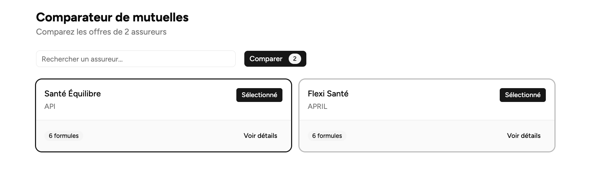
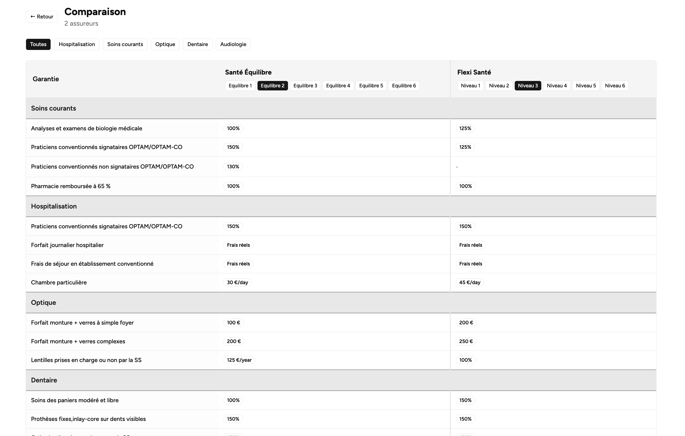

# Insurance Comparator

[](https://react.dev)
[](https://nestjs.com)
[](https://www.typescriptlang.org)
[](https://www.mongodb.com)
[](https://vite.dev)
[](https://tailwindcss.com)
[](https://docs.docker.com/compose)

Plateforme de comparaison de mutuelles santé avec parsing intelligent de garanties via Claude AI.

## Aperçu

| Liste des assureurs | Comparaison |
|:---:|:---:|
|  |  |

## Quick Start

```bash
git clone https://github.com/YoannDmg/insurance-comparator.git
cd insurance-comparator
make start
```

**Frontend** : http://localhost:5173 | **API** : http://localhost:3000

### Importer les données

```bash
cp .env.example .env    # Configurer ANTHROPIC_API_KEY
make parse-all          # Parse les PDFs via Claude
make seed               # Importe en base
```

### Commandes utiles

```bash
make up      # Lancer les services
make down    # Arrêter les services
make logs    # Suivre les logs
make help    # Voir toutes les commandes
```

## Architecture

**Pipeline de données (one-time)**
```
PDF ──▶ scripts/parse.py ──▶ JSON ──▶ make seed ──▶ MongoDB
           (Claude AI)
```

**Application (runtime)**
```
┌─────────────────────────────────┐
│       Frontend • :5173          │
│   React 19 + Vite + Tailwind    │
└───────────────┬─────────────────┘
                │ /api
                ▼
┌─────────────────────────────────┐
│       Backend • :3000           │
│     NestJS 11 + Mongoose        │
└───────────────┬─────────────────┘
                │
                ▼
┌─────────────────────────────────┐
│      MongoDB 7 • :27017         │
└─────────────────────────────────┘
```

---

## Stack

| Couche | Technologies |
|--------|--------------|
| Frontend | React 19, TypeScript, Vite, Tailwind CSS, shadcn/ui |
| Backend | NestJS 11, TypeScript, Mongoose, Jest |
| Database | MongoDB 7 |
| Parsing | Python 3, Claude API, pdfplumber |
| Infra | Docker Compose, Nginx |

---

## Installation

**Prérequis** : Docker & Docker Compose, Python 3.10+ (pour le parsing)

**Variables d'environnement** (`.env`) :

| Variable | Description |
|----------|-------------|
| `ANTHROPIC_API_KEY` | Clé API Claude (pour le parsing PDF) |
| `MONGODB_URI` | URI MongoDB (défaut: `mongodb://localhost:27017/insurance_comparator`) |

---

## Structure du projet

```
insurance-comparator/
├── backend/           # API REST NestJS
├── frontend/          # Application React
├── scripts/           # Pipeline de parsing PDF
├── data/              # Données assureurs (PDF + JSON)
├── docker-compose.yml
└── Makefile
```

| Module | Description | Documentation |
|--------|-------------|---------------|
| [backend/](backend/) | API REST, endpoints, modèle de données | [README](backend/README.md) |
| [frontend/](frontend/) | Application React, pages, composants | [README](frontend/README.md) |
| [scripts/](scripts/) | Pipeline de parsing PDF → JSON via Claude | [README](scripts/README.md) |

---

## Choix techniques

| Décision | Pourquoi |
|----------|----------|
| **NestJS 11 + React 19** | Séparation claire backend/frontend |
| **Tailwind 4 + Base UI** | Styling flexible, composants accessibles |
| **MongoDB** | Schéma souple pour prototyper vite (voir limites en "Améliorations futures") |
| **Claude Sonnet 4** | Capable de comprendre des tableaux de garanties complexes |
| **Python + pdfplumber** | Librairies PDF matures, script séparé de l'app |

---

## Scope du parsing

Le parsing actuel extrait les **garanties principales** (~15 clés normalisées) permettant une comparaison pertinente sur les postes essentiels. Cette approche volontairement limitée permet de :

- Maintenir un schéma de données simple et cohérent
- Maîtriser les coûts API (un appel Claude par PDF)
- Livrer une démo fonctionnelle rapidement

**Données extraites** : Hospitalisation, soins courants, optique, dentaire, audiologie (garanties de base)

**Hors scope actuel** : Packs optionnels (Confort, Senior), 100% Santé, praticiens non conventionnés, plafonds annuels détaillés, bonus fidélité

---

## Améliorations futures

### Architecture
Le modèle MongoDB actuel est souple mais limite le contrôle sur les données. Pour aller plus loin :
- Passer à **PostgreSQL** avec un schéma strict et des relations entre tables
- Adopter une architecture orientée objet pour mieux représenter le domaine (types de remboursement, plafonds, conditions...)
- Permettre des comparaisons plus fines et des classements fiables grâce à des données mieux structurées
- Un schéma strict permet aussi de mieux guider l'IA sur les données exactes à extraire

### Parsing
Le parsing actuel capture ~35-40% des données. Principales données manquantes :
- **100% Santé** (Classe A optique, Classe I audiologie)
- **Packs optionnels** (Confort Jeunes/Familles, Confort Seniors)
- **Praticiens non conventionnés** et hors OPTAM
- **Plafonds annuels**, bonus fidélité, périodes de carence

Une architecture plus stricte permettrait de mieux cibler ces données avec l'IA.

---

## Licence

MIT
